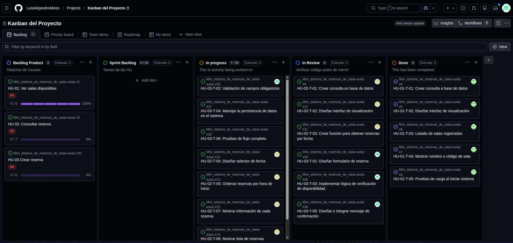

# Sprint Daily - Día 3

## Detalles del Sprint Daily - Día 3
* **Fecha de inicio:** 17 de marzo 2026, 4:45 PM
* **Fecha de finalización:** 17 de marzo 2026, 5:00 PM
* **Duración:** 15 Minutos
* **Equipo:** Product Owner (Juan), Scrum Master (Luis), Development Team (Sebastian, Jesus)
* **Notas:** El proyecto avanza hacia su punto final
 
---

## Evaluación del Daily
| DIa | Miembro | ¿Que hice ayer? | ¿Que haré hoy? | Impedimentos |
| :--- | :--- | :--- | :--- | :--- |
| 2 | Dev. (Sebastián) | Termina de programar su parte, con la correcta verificacion del codigo | Estara al tanto del avance del proyecto en el dia final | Ninguno
| 2 | Dev. (Jesus) | Trabajar en las tareas 1,2 y 3 del HU-02  | Tareas finales del HU-02 con validaciones necesarias | Inconvenientes menores
| 2 | SM. (Luis) | Implementacion de las tareas 1, 3 y 5 del HU-03 respectivas | Terminar de revisar las tareas recaladas en revision, y los HU-03 finales | Implementacion de los requerimientos, pero resuelto con indagacion
| 2 | PO. (Juan) | Revision del avance de los compañeros  | Documentacion y revision del proyecto final en Sprint Review | Problemas familiares

---

## Scrum Table Progress

| DEV | To Do | In Progress | In Review | Done |
| :--- | :--- | :--- | :--- |:--- |
| Sebastian | _**✓**_ | _**✓**_ |_**✓**_| Crear consulta a base de dato|
| Sebastian | _**✓**_ | _**✓**_ |_**✓**_ | Diseñar interfaz de visualización|
| Sebastian | _**✓**_ | _**✓**_|_**✓**_| Listado de salas registradas| 
| Sebastian | _**✓**_ |_**✓**_ |_**✓**_ | Mostrar nombre o código de sala|
| Sebastian | _**✓**_ | _**✓**_|_**✓**_ | Pruebas de carga al iniciar sistema|
 --- 

| DEV | To Do | In Progress | In Review | Done |
| :--- | :--- | :--- | :--- |:--- |
| Jesus | _**✓**_ | _**✓**_ |Crear consulta a base de dato| |
| Jesus  | _**✓**_ | _**✓**_ |Diseñar interfaz de visualización | |
| Jesus  | _**✓**_ | _**✓**_|Crear funcion para obtener reservas por fecha|| 
| Jesus  | Diseñar selector de fecha | | | |
| Jesus | Ordenar reservas por hora de inicio|||| |
| Jesus | Mostrar lista de reservas| || |
| Jesus | Mostrar informacion de cada reserva || | |
 --- 

 | DEV | To Do | In Progress | In Review | Done |
| :--- | :--- | :--- | :--- |:--- |
| Luis| _**✓**_  | _**✓**_ |Diseñar formulario de reserva| |
| Luis  | _**✓**_ | Validación de campos obligatorios | | |
| Luis  | _**✓**_ | _**✓**_|Implementar lógica de verificación de disponibilidad|| 
| Luis | _**✓**_  | Manejar la persistencia de datos en el sistema| | |
| Luis | _**✓**_ |_**✓**_ |Diseñar e integrar mensaje de confirmación| |
| Luis | _**✓**_ | Pruebas de flujo completo|| |
 ---
