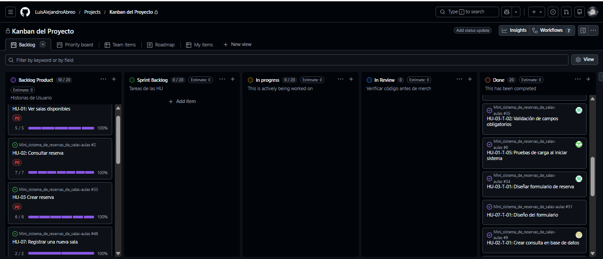

# **📑 Sprint Daily - Día 4**

## **🗓️ Detalles del Sprint Daily - Día 4**
* 🕒**Fecha de inicio:** 18 de marzo 2026, 2:15 PM
* 🕓**Fecha de finalización:** 18 de marzo 2026, 2:30 PM
* ⏳**Duración:** 15 Minutos
* 👥**Equipo:** Product Owner (Juan), Scrum Master (Luis), Development Team (Sebastian, Jesus)
* 📝**Notas:** El proyecto esta listo para presentar a los stakeholders
 
---

## 📊 **Evaluación del Daily**
| ☀️Día | 👤 Miembro | ⏪¿Que hice ayer? | ⏩¿Que haré hoy? | 🚫Impedimentos |
| :--- | :--- | :--- | :--- | :--- |
| 4 | Dev. (Sebastián) | Verifica todo el sistema | Apoya la causa en pro de la eficiencia del programa | Ninguno
| 4 | Dev. (Jesus) | Termina todas las tareas restantes del HU-02  | Verificar el funcionamiento de sus funciones | Corrige errores menores para ajustarlos correctamente
| 4 | SM. (Luis) | Termina todas las tareas restantes del HU-03 | Terminar de revisar todas las tareas pendientes en In Review y comanda el Sprint Retrospective  | Malentendido con algunas ramas pero resuelto con prioridad absoluta
| 4 | PO. (Juan) | Prgeuntas oportunas al equipo  | Revision de Sprint Review y Retrospective | Ninguno

---

## 🛠️ **Scrum Table Progress**

| 🧑‍💻DEV | 📝To Do | 🚧In Progress | 🔍In Review | ✅Done |
| :--- | :--- | :--- | :--- |:--- |
| Sebastian | _**✓**_ | _**✓**_ |_**✓**_| Crear consulta a base de dato|
| Sebastian | _**✓**_ | _**✓**_ |_**✓**_ | Diseñar interfaz de visualización|
| Sebastian | _**✓**_ | _**✓**_|_**✓**_| Listado de salas registradas| 
| Sebastian | _**✓**_ |_**✓**_ |_**✓**_ | Mostrar nombre o código de sala|
| Sebastian | _**✓**_ | _**✓**_|_**✓**_ | Pruebas de carga al iniciar sistema|
| Jesus | _**✓**_ | _**✓**_ |_**✓**_|Crear consulta a base de dato |
| Jesus  | _**✓**_ | _**✓**_ | _**✓**_  | Diseñar interfaz de visualización |
| Jesus  | _**✓**_ | _**✓**_| _**✓**_|Crear funcion para obtener reservas por fecha| 
| Jesus  |  _**✓**_ |  _**✓**_| _**✓**_ | Diseñar selector de fecha|
| Jesus |  _**✓**_ | _**✓**_ | _**✓**_ |  Ordenar reservas por hora de inicio|
| Jesus |_**✓**_| _**✓**_|_**✓**_| Mostrar lista de reservas|
| Jesus |_**✓**_ |_**✓**_| _**✓**_| Mostrar informacion de cada reserva|
| Luis| _**✓**_  | _**✓**_ |_**✓**_| Diseñar formulario de reserva|
| Luis  | _**✓**_ |  _**✓**_ |  _**✓**_ | Validación de campos obligatorios |
| Luis  | _**✓**_ | _**✓**_|_**✓**_|Implementar lógica de verificación de disponibilidad| 
| Luis | _**✓**_  | _**✓**_ |_**✓**_  | Manejar la persistencia de datos en el sistema|
| Luis | _**✓**_ |_**✓**_ |_**✓**_| Pruebas de flujo completo|
| Luis | _**✓**_ | _**✓**_|_**✓**_| Pruebas de flujo completo|
 ---
